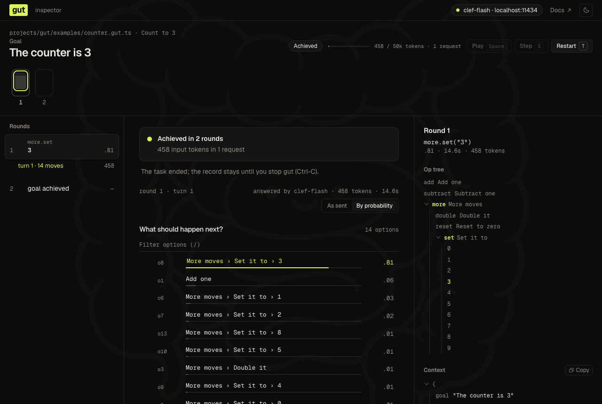
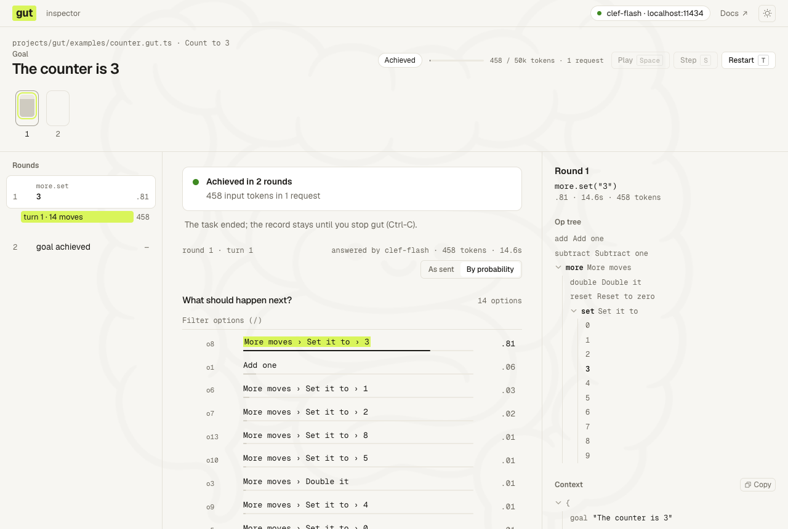

# gut

**A non-deterministic runtime.** You write the moves. The model writes the order.

Non-deterministic as in a nondeterministic machine, or McCarthy's `amb`: at every step several
moves are legal, and something chooses one. In gut that something is a fast decision model, so the
choice is not random: the same view gives the same pick.

An agent gives gut a goal and the moves it may make. Every round, gut shows the decision model the
goal, what the world looks like now, and the moves available. The model picks one and gut runs it,
until the goal is met (checked by the task's code, or claimed by the model when code can't check
it) or gut halts back to the agent. The model only ever *picks*: it never writes text.

> **Status:** core v0 is built: `initGut`, `op`, `group`, `gut run`, and the examples below, and so
> is `@gut.run/playwright` v0 (`observe`). `gut browser`, the JSON result
> on stdout and the JSONL trace are designed here but not built.
> This file is the current design; it changes in place.

## When gut fits

Ask one question: **can you write the flowchart?**

| You know… | Use |
| --- | --- |
| the steps and their order | plain code |
| the steps and their order, with a judgment at fixed points ("is this a billing ticket?") | plain code that asks a decision model at those points |
| **every move that is allowed, but not the order**: it depends on what the world shows each time | **gut** |
| not even the moves, or each step needs real reasoning or writing | a full LLM agent |

gut is for ambiguous *paths* made of easy *steps*: racing across Wikipedia, finishing a checkout on
a site you haven't seen, finding the right page in unfamiliar docs. The next move depends on what
the last one revealed, but each move is a small pick among described options. A decision model makes
each pick without generating text, cheaply and fast, and a run stops when the goal is met or halts on a stall, the budget, an error or nothing left to pick. The big model works once per
run, not once per step.

## Features

- **You write the moves; the model writes the order.** A task is ordinary TypeScript: a function
  that returns what the model reads and the moves allowed right now. gut runs the loop.
- **More options than a model can take.** Hand gut every option, at any length; the model still
  sees each one (below).
- **The goal is the finish line.** A task that can check it in code does (`isGoalAchieved`), and
  the model is never asked. Otherwise each round's first request also asks the model whether the
  goal is met, at no extra request, and the run ends as `achieved` for the caller to check.
- **Cheap and fast.** Decision models never generate and charge only for input: Jev on OpenRouter
  answers in about 255 ms at $0.042 per million input tokens, and clef-flash runs free on a laptop.
- **Bounded.** An input-token budget, stall detection, and a result that says how the run ended and
  what it spent.
- **Any `/v1/systemone` model.** Clef on a local Ollama, TypeSafe's Jev, Jev on OpenRouter; nothing
  is tuned per model.
- **A fraction of the code.** The wiki race is 39 lines with gut and about 145 without
  ([the comparison](#a-task)).

### More options than a model can take

A decision model answers questions of a limited number of options (255 on TypeSafe's Jev, 26 on
Ollama), within a size limit per request (clef-flash on Ollama: a 16,384-token context), and every option costs it about 18 tokens of framing. A Wikipedia
article has hundreds of links; a page or a menu can have thousands of choices. Ops and `choices` can
be any length, and gut makes sure every one is within the model's reach:

- **Bundles.** A list too long for one question is asked as bundles: options that each list
  everything they hold, one per line under "Contains:", so many titles share one option's
  framing. The model picks a bundle, then an option inside it.
- **Groups.** A question opens the smallest groups while they fit; a closed group shows an
  indented outline of its first 8 moves and how many more it holds, and choosing it asks every move
  inside.
- **Split on refusal.** A question the server refuses as too large is split in half, each half picks
  its best, and the two winners are asked. Refusals aren't billed, so this needs no token counting
  and adapts to any model.

Nothing is cut, sampled or ranked away by code: a move the model never reads sits in a bundle or
group it passed over, never dropped.

## From the command line (planned)

The main use needs no script: `gut browser` takes a goal and a page to start from, and runs the
same task a script would write with [the browser library](#the-browser).

**A goal is the end state you want to see**, written so it can be checked against the context: "the
page shows the Rate limits documentation", not "find the rate limits". A check in code is better:

```sh
gut browser 'The current documentation page is the Rate limits page' \
  --url 'https://docs.example.com/' \
  --until-url 'https://docs.example.com/reference/rate-limits'

gut browser --request /absolute/path/route-search.browser.json   # values to type, buttons to allow, checks
```

By default only links to the starting origin are offered. A request file names the buttons it allows
and binds each value to the field it may be typed into. The run prints JSON when it ends:
`achieved` when the `--until` check passed, `claimed` when only the model judged the goal met, or
`halted` with a reason. The calling agent reads the answer from the final context. Anything more
dynamic is a script for `gut run`.

## A task

A script adds moves of its own. The Wikipedia race: get from one article to another by following
links only.

```ts
// wikirace.gut.ts     gut run wikirace.gut.ts
import { initGut, op } from '@gut.run/core';
import { readArticle } from './wikipedia.ts';

const target = 'Roman Empire';
const path = ['Banana'];
const instruction =
  'You are helping the user decide the next step for their wiki race ' +
  'by picking the most relevant link to click to reach their goal';

const { runTask } = await initGut();

await runTask(
  `Banana → ${target}`,
  async () => {
    const article = await readArticle(path.at(-1) ?? '');
    path.splice(-1, 1, article.title); // a link can name a redirect; keep the real title

    return {
      context: {
        instruction,
        goal: `The current article is "${target}"`,
        currentArticle: article.title,
      },

      ops: {
        openLink: op('Open a link on the current article', {
          choices: article.links.filter(link => !path.includes(link)),
          invoke: link => {
            path.push(link);
          },
        }),
      },
    };
  },
  { isGoalAchieved: () => path.at(-1) === target },
);
```

A run on clef-flash, one line per round, with a probability per level: the op (1.00, the only one,
so not asked), a bundle, then a link inside it. The last round is the title check, with no
request:

```
round 1  openLink("Columbian exchange")  1.00/0.15/0.38  10.5s  2889 input tokens
round 2  openLink("Christopher Columbus")  1.00/0.21/0.32  4.7s  1715 input tokens
round 3  openLink("Paolo dal Pozzo Toscanelli")  1.00/0.13/0.18  8.3s  2977 input tokens
round 4  openLink("Strabo")  1.00/0.13/0.78  2.6s  839 input tokens
round 5  openLink("Roman Empire")  1.00/0.22/0.83  3.1s  1158 input tokens
round 6  achieved  checked  0.9s
achieved  9578 input tokens in 10 requests
```

[`examples/wikirace.plain.ts`](examples/wikirace.plain.ts) is the same race as a plain one-off
script on TypeSafe's SDK (`@typesafe-ai/sdk`), making the same requests (the same picks,
probabilities and tokens on clef-flash) in 150 lines: bundles, splitting on refusal, the budget
and the log, written out. [`examples/wikirace.advocaat.ts`](examples/wikirace.advocaat.ts) does it
with [advocaat](https://github.com/pithings/advocaat)'s `ask` in 143: a client saves the HTTP code,
not the loop around it.

- `initGut(options?)` reads the config once ([Configuration](#configuration)) and returns
  `{ runTask }`, which runs tasks on it.
- `runTask(name, observe, options?)` calls `observe` at the start of every round and resolves when
  the run ends, with its outcome, its steps, the last context and its `usage` (input tokens and requests).
  - `inputTokenBudget` (default 50,000) is how many input tokens the run may spend on the decision
    model. It is checked before each request, so a run overshoots by at most one request. Decision
    models charge only for input, and their time scales with it.
  - `isGoalAchieved` checks the goal in code, each round after `observe` and before any request: true
    ends the run as `achieved`. Set it whenever the task can check its goal; the model is then
    never asked about the goal, so it can't stop a run on a near miss, and `goal` only gives it
    direction. Unset, the model judges the goal ([What the model receives](#what-the-model-receives)).
- `name` tells the run apart from the task's other runs, where people see it (`gut run --inspect`);
  the model never reads it.
- `observe` returns this round's `context` and `ops`.
  - `context` is `{ goal: string, ...rest }`, where everything in `rest` must be JSON. It is exactly
    what the model reads. A line saying what the user is doing and what a good pick is (the `instruction`
    above) is what gives the model direction; without it, picks drift. The wiki race keeps it to one
    line; a real task should say more: the rules, what a good move looks like, and preferences.
  - `ops` is a keyed record of moves; falsy entries (`false`, `null`, `undefined`) are skipped, so
    `key: cond && op(…)` is the conditional.
- `op(description, invoke)` or `op(description, { choices, strategy?, invoke })` is a move.
  - `choices` is a list of strings, or `{ label: value }` for values that aren't strings. The model
    picks one and `invoke` receives it. An empty list hides the op.
  - `strategy` is how choices that don't fit one question are asked: `ListStrategy.bundle` (the
    default; "Contains: …" bundles, then the choice inside one) or `ListStrategy.knockout` (pages of
    `maxOptions` choices, then the page winners).
- `group(description, ops)` groups ops, for example one group per form on a page.
- State is ordinary variables. Nothing is serialised.

## The browser

`@gut.run/playwright` turns a Playwright page into what a round returns. A caller knows a start URL,
a goal in words and maybe some values to type, not the site's URLs or field names, so that is all a
task needs; the model judges when the goal is met:

```ts
import { initGut } from '@gut.run/core';
import { type Control, observe, secret } from '@gut.run/playwright';
import { chromium } from 'playwright';

const goal = 'A flight search for Tokyo on 2026-10-15 is submitted';
const values = {
  destination: 'Tokyo',
  date: '2026-10-15',
  password: secret(process.env.PASSWORD ?? ''),
};

const { runTask } = await initGut();
await using browser = await chromium.launch();
const page = await browser.newPage();
await page.goto('https://flights.example.com/');

// Links stay on the site the task started on.
const site = new URL(page.url()).host;
const isOnSite = (control: Control) => {
  if (control.url === undefined) return true; // not a link
  return URL.canParse(control.url) && new URL(control.url).host === site;
};

const result = await runTask(`Book a flight to ${values.destination}`, async () => {
  const { context, ops } = await observe(page, { values, shouldOffer: isOnSite });
  return { context: { goal, page: context }, ops };
});
// The final page's visible text is in result.context.page.text.
```

`examples/browser.gut.ts` is that task from the command line:

```sh
gut run projects/gut/examples/browser.gut.ts https://news.ycombinator.com \
  "The comments page of the top story on the front page is open"
```

- `observe(target, { values?, shouldOffer? })` settles the page and returns `{ context, ops }`. The
  context is the page's `url`, `title`, `headings`, visible `text` (blank lines collapsed, cut at
  4,000 characters), `fields` (each field's value, a checkbox's `checked` or `unchecked`, a
  select's chosen option, keyed by its path: "Sign in › Email") and, when the last move on this
  page failed, `failedMove` (`{ move: 'Click "Menu"', error: 'the control is covered by <div
  class="backdrop">' }`). It has no `goal`: the task adds one, and reshapes the rest as it likes
  (`const { text, ...page } = context` leaves the text out).
  A `Locator` as the target keeps one part of the page; it must match exactly one element.
- The ops are every enabled control on the page, nested as groups along its path: the named
  landmarks (Header, Navigation "Global", Main content, Footer, a dialog or form), the headings
  above it, and the item it sits in. An item is a row, list item or article, or a box shaped like
  its siblings (a shop's product cards), and it is named by its first heading, else its longest
  control name ("View details for Sauce Labs Backpack"), unless it has a name of its own. Core opens as much of that tree as a
  question takes, so a page of any size is asked the same way.
- A control a click can't reach is not offered: one that is hidden, outside every open modal
  dialog, or in the viewport under something else (an overlay, a backdrop) on each of its lines. A
  covered field still shows in `fields`. A control outside the viewport is offered, as the click
  scrolls to it.
- A move says what it does: `Open link "X"`, `Click "X"`, `Check` or `Uncheck "X"` by its state,
  `Choose "X"` (a radio, tab, menu item or option), `Fill "X"`, `Select in "X"` (its visible
  options), and `Open "X"` for a dropdown whose options aren't on the page until it opens.
- `values` is what the model may type, by what it is. Every text field is offered every value,
  labelled "destination: Tokyo"; a value a field already holds is not offered again, and a number
  field takes only numbers. A `secret(…)` goes to password fields only, offered by its name
  ("password"), and is replaced by `[secret]` wherever the model would read it: the context, the
  moves, their paths and an error an op throws.
- `shouldOffer(control)` decides which controls become moves; every one does by default. A
  `Control` is its `role`, `name`, `path` and, for a link, its absolute `url` (`<base>` included).
  Keeping links on the start site, as above, is one line, and worth it: offered every link, the
  Hacker News FAQ task ended on Y Combinator's FAQ.
- An op acts on the exact element it was read from, and never clicks something else with the same
  label. A move that fails on the page (its element covered, gone after a re-render, or not ready
  within 5 s) doesn't throw: the next `observe` reports it as `failedMove`, and the model picks
  again. Anything else, such as a closed browser, throws and halts the run.
- Settling waits for the DOM to stop changing (100 ms, at most 2 s) and for `aria-busy="true"` to
  clear (at most 5 s); a page still busy says `busy: true`. A page that navigates while `observe`
  reads it is read again, for up to 10 s, and so is one with every control covered (a dialog still
  loading its content over the page), for up to 3 s. Password values never reach the context, and a
  field whose type can't be read is treated as a password.

### How it does

The measured run was 15 of the bench's tasks (8 on local fixture sites — a docs site with a page of
30 links, an office directory of identical "Details" links, a two-field form, and results behind a
dialog, each in two layouts — and 7 on live sites; the bench also has a Wikipedia race). Each run
gets only what a caller knows: the start URL, the goal in words and the values to type, with links
kept on the start site. The model decides when it is done; a check in code that knows the answer
grades the run afterwards. On Jev, 3 runs each, with questions of up to 255 options (Jev's limit)
and of up to 26 (measured 2026-10-09);
[jev-ultrafast](https://github.com/browser-use/jev-ultrafast), TypeSafe and Browser Use's own Jev
browser agent, was given the same goal and values (measured 2026-10-08):

| Task | gut, 255 | gut, 26 | jev-ultrafast |
| --- | --- | --- | --- |
| 8 fixture runs (docs, directory, form, delayed × 2 layouts) | 24/24 | 24/24 | 19/22 |
| Wikipedia: search for an article | 3/3 | 3/3 | 3/3 |
| Hacker News: the top story's comments | 3/3 | 3/3 | 3/3 |
| Hacker News: the FAQ (a footer link) | 3/3 | 3/3 | 0/3 |
| GitHub: a repository's newest release | 3/3 | 3/3 | 0/1 |
| GitHub: Trending | 3/3 | 3/3 | 0/2 |
| saucedemo: log in, add two products, check out | 3/3 | 3/3 | 0/3 |
| **All above** | **42/42** | **42/42** | **25/37** |
| Jev requests and tokens per run | 3.4, 8.1k | 4.2, 7.2k | 3.3, 11.6k |
| arXiv: open the GPT-4 Technical Report | 0/3 | 0/3 | not run |

No run of gut ended by claiming a goal that wasn't met. Its misses were all arXiv's, which stalled
between its search forms and results: a result's link is named by its id ("arXiv:2303.08774"), and
the title beside it isn't (HANDOFF). A move failed on the page in 2 runs, both arXiv clicks that
timed out, and came back to the model. Before failed moves came back, every arXiv run halted on a
click or a navigation. Runs on a live site vary: other runs that day went 2/3 and 1/3 on arXiv, and
1/3 to 3/3 on GitHub Trending at 26 before an open dialog still loading its content was waited for.
jev-ultrafast offers only what is in the viewport and stopped as `BLOCKED` at a footer link, at a
dialog, and at a login form its text model returned no value for; 5 of its 42 runs failed in its
browser harness and are left out. These tasks need no scrolling, which it supports and gut doesn't
yet. Running the bench is in [AGENTS.md](AGENTS.md); the measurements and what was rejected are in
[DECISIONS.md](DECISIONS.md).

Other capabilities, such as a desktop through its accessibility tree or a coding agent through
[acpx](https://github.com/openclaw/acpx), are planned the same way: a library that observes and
builds ops, which a task mixes with its own in ordinary code.

## Names

A step is named by its key path, which is how the log, the trace and the model's options refer to
it:

```
round 3  browser.searchForm.to("Tokyo")         0.94   1.2s
round 4  browser.searchForm.submit              0.97   0.8s
round 5  browser.results.select("BA 7, £420")   0.71   1.9s
```

Keys are unique among siblings by construction. An op reused under different keys takes each key
path. Options are offered in the order the keys were written, except that integer-like keys come
first, as in any JS object. Levels the runtime adds to split a long list stay out of the name.

## What the model receives

```jsonc
{
  "state": {
    "instruction": "You are helping the user decide the next step for their wiki race by picking the most relevant link to click to reach their goal",
    "goal": "The current article is \"Roman Empire\"",
    "currentArticle": "Fruit"
  },
  "questions": {
    "achieved": {
      "type": "choice",
      "instructions": "Is the goal achieved?",
      "criteria": {
        "achieved": "Goal achieved: The current article is \"Roman Empire\"",
        "notYet": "Goal not achieved yet"
      }
    },
    "next": {
      "type": "choice",
      "instructions": "What should happen next?",
      "criteria": {
        "o1": "Open a link on the current article",
        "o2": "Go back to the starting article"
      }
    }
  }
}
```

`state` is the context, nothing added. A round's first request asks two questions about it: whether
the goal is achieved, and the round's first real choice (a level with one option has nothing to
ask). They are answered together and independently, so checking the goal costs no extra request
and sends the context once; only a round with nothing to choose (one move, or none at all) asks the goal alone. When the goal is achieved the run ends and the move is
ignored. A task with `isGoalAchieved` (the wiki race) is never asked the `achieved` question;
its requests carry only the move. Later requests in the round ask only the move, one level
further down, worded "Current action: Open a link on the current article. Which one?" (the
descriptions down to this level), since an option alone, such as a city, may not say what it is for.
Every request carries the whole state again: the API keeps nothing between requests. Measured on Jev over 15 articles (the start, a near miss and the target, for five
races), "Goal achieved" scored 0.99–1.00 at the target and at most 0.05 elsewhere.

## One round

1. **Read.** The task's `observe` runs, observing what it needs (a page, through `observe`).
2. **Check.** `isGoalAchieved`, if set, runs; true ends the run as `achieved`, with no request.
3. **Choose.** Without `isGoalAchieved`, the goal rides with the round's first question, and a round
   with nothing to choose (one move, or none at all) asks it alone. Each op's choices count as
   moves of their own. A question starts with every group closed and opens the smallest first, at
   any depth, while it stays within `maxOptions`: an open group's moves read with their path
   ("Header › Open link "Home""), a closed one with what it contains (an indented outline of its
   first 8 moves), and choosing a closed group asks inside it. Its first question ends with "None
   of these: go back" while a level above has anything else to choose (at `maxOptions` 2 it is an ordinary option, and may be bundled). A
   level with one option is skipped. A long list is split into bundles that each list everything they hold
   (each on its own line under "Contains:"); Clef wraps every option in about 18 tokens of framing, so 26 titles in one bundle
   cost far less than 26 options. A level the server refuses as too large (Ollama: over 64 KiB, or
   past the model's context) is split in half, each half picks its best, and the two winners are
   asked. Refused requests are not billed, so no size is estimated per model.
4. **Gate.** A goal answered as achieved ends the run as `achieved`, for the caller to check. The
   run halts with a reason when there are no options (once the goal is asked), anything throws, the run
   stalls (the same context and the same pick three times), or the input-token budget runs out.
   There is no confidence threshold: every pick runs, and its probabilities are logged.
5. **Invoke** the picked op with its choice.

## Inspecting a run

`gut run <task.gut.ts> --inspect` serves the run as a page on 127.0.0.1, while it goes and after it
ends. Every round and every turn is there, with the text the model read and the probability it gave
each option. Use it to answer "why did it pick that?", or to be the decider yourself. The options slider in
the run header sets how many options a question offers: in Step, moving it re-picks the waiting question
at the new size, capped by the model's limit. In Step, E edits what the model reads for the waiting
pick (descriptions, labels, hidden moves, the context), and Pick again re-picks with the edits; the
round is marked edited, and its panel copies the changes into your task.

```sh
gut run /path/to/task.gut.ts --inspect
gut run /path/to/task.gut.ts --inspect --port 4321 --no-open
```



- **Round strip** (top): one block per turn, filled to the chosen option's probability. A person icon
  marks a turn you answered.
- **Rounds** (left): each round, with its turns under it.
- **Turn** (middle): the question as sent, each option with its probability. "By probability" sorts
  the options; "As sent" shows them as the model saw them.
- **Round** (right): the step picked, the op tree with its path lit, and the round's context.



**Play** (Space) lets the model answer every turn until you pause. **Step** (S) does one thing: it asks
the model the waiting turn, or runs the picked step. You can also answer a turn yourself: choose its
options (number keys, or G and N on the goal), then ↵. When a step is picked, ↵ runs it and R picks
again. **Restart** (T) runs the task again from the top.

The model comes from the task's gut config, or from the model chip in the bar, which opens a dialog for
a gut config file (the default paths, or one by its path), your own key (TypeSafe, OpenRouter,
Cloudflare, or a custom `/v1/systemone` endpoint), or Ollama. Keys stay in the local `gut` process.
Without a model, Play is off and every turn is yours to answer.

Every flag and key is in [packages/cli/README.md](packages/cli/README.md).

## Trace

Each round logs one line to stderr: the step, its probabilities, the time and the input tokens; the
run's last line is its outcome and total usage. A JSONL trace per round (the context, the top options,
the pick and the timings) is planned, for debugging. A run that has ended is never continued, because the world it saw (a
browser page) has moved on; run again instead.

## Packages

| Package | What it is |
| --- | --- |
| `@gut.run/core` | `initGut`, `op`, `group`, the decision-model client |
| `@gut.run/playwright` | `observe` over a Playwright page or locator; `playwright` is yours to install |
| `@gut.run/cli` (bin `gut`) | `gut run task.gut.ts`; planned: `gut browser '<goal>' …` |

The API is plain TypeScript.

```sh
npm install @gut.run/core && npm install --global @gut.run/cli
```

## Configuration

A gut file says where its config comes from when it calls `initGut`:

- `await initGut()` reads `gut.config.json` in the working directory, else `~/gut.config.json`.
- `await initGut({ configJsonPath: '/path/to/gut.config.json' })` reads only that file; a relative
  path resolves from the working directory.
- `await initGut({ config: { decisionModel: … } })` takes it inline, checked like a file.

Files don't merge.

```json
{
  "decisionModel": {
    "endpoint": "http://localhost:11434/v1/systemone",
    "name": "clef-flash",
    "capabilities": { "image": false, "choiceQuestions": { "maxOptions": 26 } }
  }
}
```

`decisionModel` is everything about the model, in one place:

- `endpoint` is any `/v1/systemone` server: a local Ollama, or TypeSafe. It must report
  `usage.input_tokens`, which the token budget counts. A network error, 429 or 5xx is retried 3
  times, after 1, 2 and 4 s.
- `name` is the model the server runs: `clef-flash`, or `~typesafe/jev-latest` on OpenRouter.
- `apiKey`, optional, is sent as `Authorization: Bearer <apiKey>` (TypeSafe's API, OpenRouter).
- `capabilities`, optional, says what the model can take; every field has a default:
  - `choiceQuestions.maxOptions` is the most options one choice question takes: 255 by default, as
    TypeSafe's Jev takes. Ollama takes at most 26 and rejects more ("criteria must contain 2–26
    candidates"), so an Ollama config sets 26, as above. Every list strategy asks within it.
  - `image` is whether the state may hold images (default `false`). Nothing in gut sends one yet.

The file says where the model is and what it takes, nothing else; what a run may spend is the
task's option. Any other key, at any level, is an error.

With no file, `initGut()` fails before any task runs and says where to put one.

## Open questions

1. Should the browser offer values it finds on the page (autocomplete suggestions) as choices, and
   what does a page need beyond its controls (scrolling, uploads)?
2. Is a decision model a better picker than a small LLM? Unmeasured; the API doesn't depend on it.
3. Ops with side effects that can't be undone (paying, sending): does a run need permission to pick
   them?
4. Parked: tasks that collect, or find a minimum or maximum, as a fold over the stream of rounds
   (`for await (const round of run)`, where `break` ends the run).
